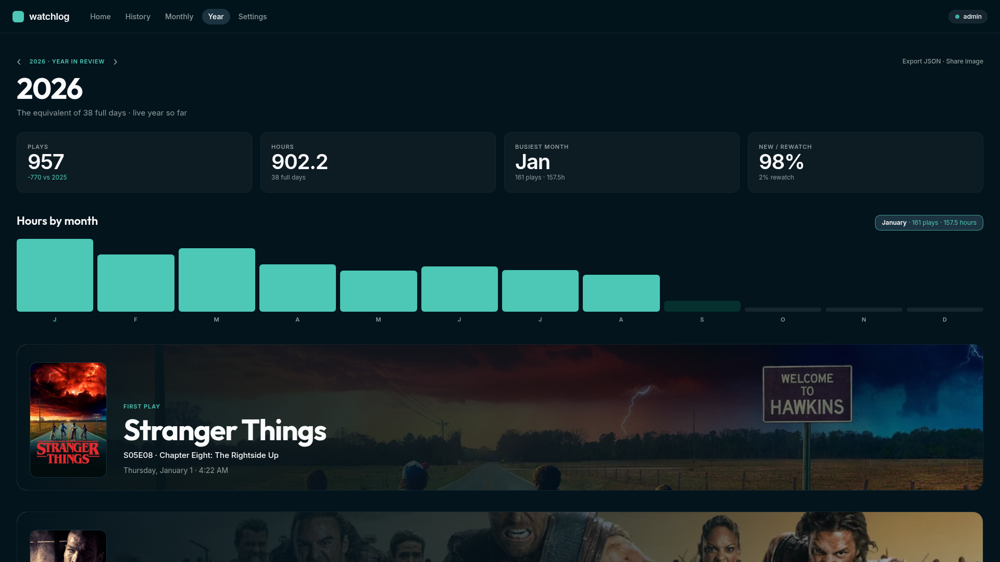

# Watchlog

Watchlog is a self-hosted companion for a [tofa](https://tofa.tv) media server. It records every play, syncs the ones that count to [Trakt](https://trakt.tv) with a real timestamp, and turns that history into monthly and yearly reviews.

tofa knows what you watched. Trakt is where a portable history lives. Marking things watched by hand drops the times that make the record worth keeping. Watchlog sits between them: it polls tofa, keeps a local ledger of each play, and posts to Trakt only when you ask.

It does not play video, browse your library, or write anything back to tofa.




## What it does

Ingestion and sync are separate. Every play tofa reports is stored and shows in History. Only plays that meet your rules are queued for Trakt.

A play becomes eligible when it meets the completion threshold, falls inside the current sync window, and can be matched to a movie or episode. Rewatches are separate plays. Partial plays stay in the ledger.

Nothing is posted on a timer. You sync with **Run sync now**, **Sync now** on a row, or **Sync to Trakt** on a History selection. Before sending, Watchlog compares local plays with history already on Trakt and skips matches, so an existing account is not filled with duplicates. Timestamps are sent as when the play finished, or from the start time if you prefer that.

Monthly and yearly reviews are built from Trakt history (with local artwork and provider overlays). History is the local ledger from tofa.

## Features

**Home.** Connection health for tofa, Trakt, and TMDB, pending count, needs attention, and the last successful sync. A pending carousel from the local ledger, recently watched and upcoming from Trakt, a preview of the current month, and failed or unmatched items when something needs a look.

**History.** The full local ledger, grouped by day. Filter by movies or TV, sync state, and title search. Each row shows artwork, title / episode, when it was watched, duration, and why it is pending, synced, not synced, failed, or unmatched. Select plays and **Sync to Trakt**, or use a row menu to sync now, retry, ignore, or remove a play from Trakt. **Import from Tofa** pulls the latest watch history.

**Sync.** Three modes: manual, where nothing posts until you say so; newly watched only, from the moment you turn it on; or everything, including a confirmed backfill of older history. Completion thresholds, an Import from Tofa schedule, an Import from Trakt (reconciliation) schedule, and a match window are all settings. Import from Tofa pulls plays. Import from Trakt downloads Trakt history. Neither step posts a play.

**Monthly review.** Plays, hours, movies versus episodes, and how the month compares with the last one. First play of the month, genre splits, a calendar of active days, titles you returned to, and JSON/CSV export. Numbers use your timezone.

**Year in review.** Totals, hours by month, first play, longest binge, top shows and movies, and a shareable image. The current year is a live preview.

**Connections.** tofa by API key or device flow, Trakt by your own app and a device-code approval, and a TMDB key for artwork and provider snapshots. Secrets are never shown again after save.

**Your data.** Timezone, week start, and whether partial plays count. Export or import history. Clearing sync records, wiping local history, or forgetting a connection each ask you to type the action name, and each one says what it does not touch on Trakt.

**About.** Version, build, uptime, and whether a newer GitHub release is available. Job history and the audit trail live under Logs.

Watchlog runs as one container with a single volume. SQLite holds the ledger. Secrets are encrypted at rest.

## Run it

The image is [`ghcr.io/dxtrlws/watchlog`](https://github.com/dxtrlws/Tofakt-/pkgs/container/watchlog). The package is private, so Portainer and other hosts need a GitHub token with `read:packages` and `repo` before they can pull it. Pass that same token into the container as `WATCHLOG_GITHUB_TOKEN` if you want Settings → About to see new releases.

```yaml
services:
  watchlog:
    image: ghcr.io/dxtrlws/watchlog:latest
    ports:
      - "9477:9477"
    environment:
      TZ: UTC
      DATABASE_PATH: /data/watchlog.db
      WATCHLOG_GITHUB_TOKEN: ${WATCHLOG_GITHUB_TOKEN:-}
      # BASE_URL: https://watchlog.example.com
      # PUID: "1000"
      # PGID: "1000"
    volumes:
      - watchlog-data:/data
    restart: unless-stopped

volumes:
  watchlog-data:
```

```bash
docker compose up -d
```

Open http://localhost:9477 and create the local admin. Connect tofa, Trakt, and TMDB under Settings.

`/data` holds the SQLite database and encryption key. Set `BASE_URL` when Watchlog sits behind a reverse proxy. Optional `PUID` / `PGID` (default `1000`) own that volume.

This repository’s [`docker-compose.yml`](docker-compose.yml) can also build from source. Reverse-proxy notes for Caddy, nginx, and Traefik are in [`docs/DEPLOY.md`](docs/DEPLOY.md). The package page copy lives in [`docs/package/README.md`](docs/package/README.md).
