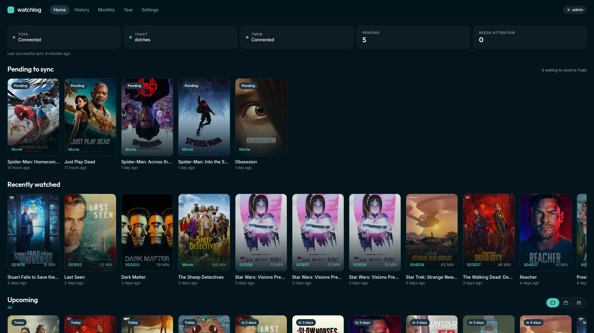
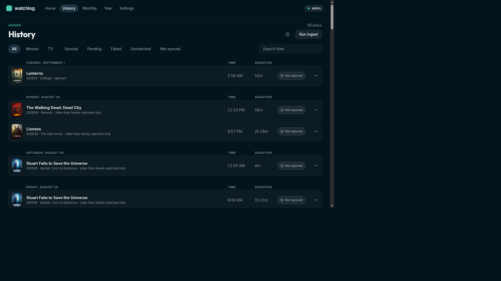
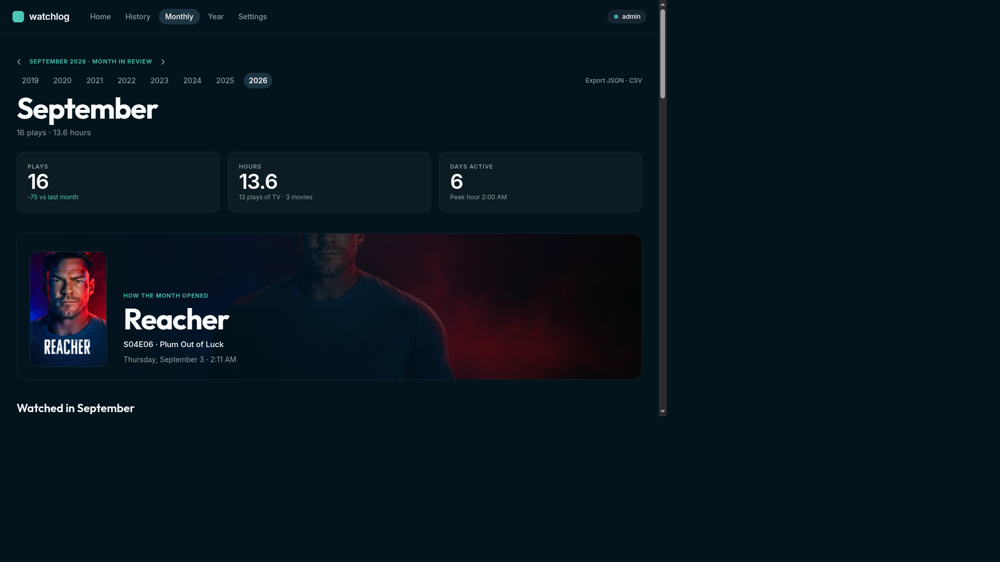

# Watchlog

Watchlog is a self-hosted companion for a tofa media server. It records every play, sends the ones that count to Trakt with a real timestamp, and turns that history into monthly and yearly reviews.

tofa knows what you watched. Trakt is where a portable history lives. Marking things watched by hand drops the times that make the record worth keeping. Watchlog sits between them: it polls tofa, keeps a local ledger of each play, and syncs only the plays you meant to count.

It does not play video, browse your library, or write anything back to tofa.

## What it does

Ingestion and sync are separate. Every play tofa reports is stored and shows up in history and statistics. Only plays that pass the rules you set are posted to Trakt.

A play becomes eligible when it meets the completion threshold, falls inside the current sync window, and can be matched to a movie or episode. Rewatches are separate plays. Partial plays stay in the ledger and are left off the stats unless you turn that on.

Before the first backfill, Watchlog compares local plays with history already on Trakt and skips matches, so an existing Trakt account is not filled with duplicates. Timestamps are sent as when the play finished, or from the start time if you prefer that.

## Features

**Home.** Connection health for tofa, Trakt, and TMDB, the pending and needs-attention counts, and the last successful sync. Recently watched plays, a preview of the current month, and a list of failed or unmatched items when there is something to fix.

**History.** The full ledger, grouped by day. Filter by date, movies or TV, sync state, and search. Each row shows the title, episode identity, when it was watched, and why it is synced, pending, skipped, failed, or unmatched. From a row you can sync now, retry, ignore, fix a match, or remove the play from Trakt.

**Sync.** Three modes: everything, including a confirmed backfill of older history; newly watched only, from the moment you turn it on; or manual, where nothing posts until you say so. Completion thresholds, ingest schedule, and a reconciliation pass against Trakt are all settings. Ingest pulls from tofa. Reconciliation downloads Trakt history. Neither of those steps posts a play.

**Monthly review.** Plays, hours, movies versus episodes, and how the month compares with the last one. First play of the month, genre splits, a calendar of active days, and the titles you returned to. Numbers use your timezone. A month with no plays stays empty instead of showing a grid of zeros.

**Year in review.** The year as twelve months: hours in human terms, busiest stretches, first and last play, and the shows and movies that defined it. The current year is a live preview.

**Connections.** tofa by API key or device flow, Trakt by your own app and a device-code approval, and a TMDB key for artwork and provider snapshots. Saved credentials stay visible. Test connection waits until that provider is actually authorized.

**Your data.** Timezone, week start, and whether partial plays count. Export history as JSON or CSV, and import a previous export. Clearing sync records, wiping local history, or forgetting a connection each ask you to type the action name, and each one says what it does not touch on Trakt.

Watchlog runs as one container with a single volume. SQLite holds the ledger. Secrets are encrypted at rest.

## Published image

The image is [`ghcr.io/dxtrlws/watchlog`](https://github.com/dxtrlws/Tofakt-/pkgs/container/watchlog).

How to run it is in [`docs/package/README.md`](docs/package/README.md). That file is what the package page shows. This README is for the repository.
